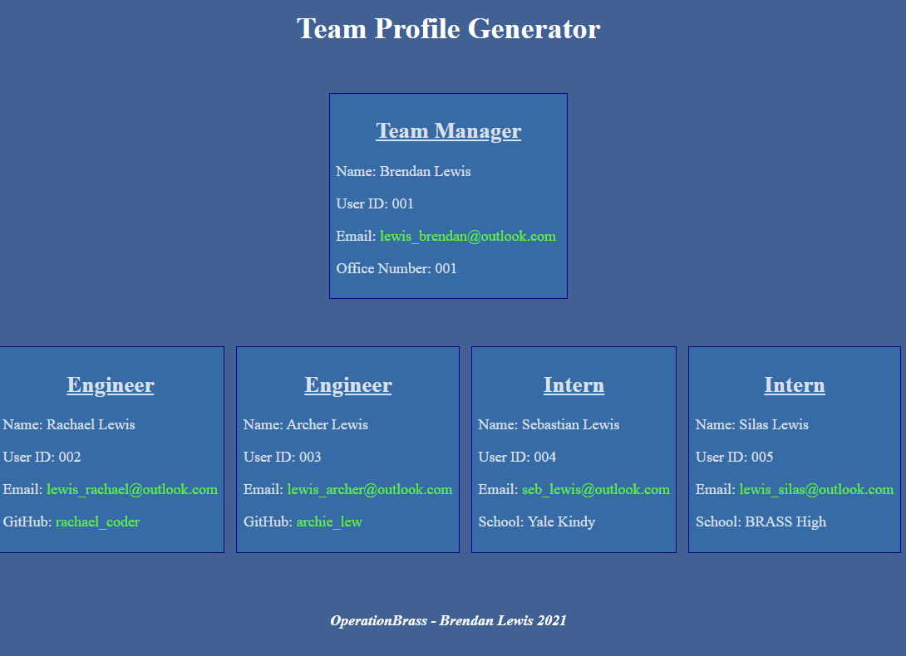

# Team Profile Generator

  

  

          
### Description 

CLI application takes in employee information and provides a HTML report of the team members

### Table of Contents

* [Usage Guide](#Usage-Guide)
* [Install Instructions](#Installation)
* [Technologies Used](#Technologies-Used)
* [Contributions](#Contributions)
* [Tests](#Tests)
* [Questions](#Questions)

## Usage Guide 

Profile of team members and to bring about all concepts currently learned 

## Installation 

run NPM install in the application directory. Then run node index.js to get going

## Technologies Used 

Node, Inquirer and the Jest error framework was used to create this application

## Contributions 

This is currently my own work. Please feel free to submit your contributions on GITHUB with credits given

## Tests 

Run NPM test from within the __TEST__ folder

## Questions 

If you have any questions or want to keep up with my latest projects, please follow me on [Github](http://www.github.com/operationBrass) or contact me via [Email](mr.brn.lewis@outlook.com). 
